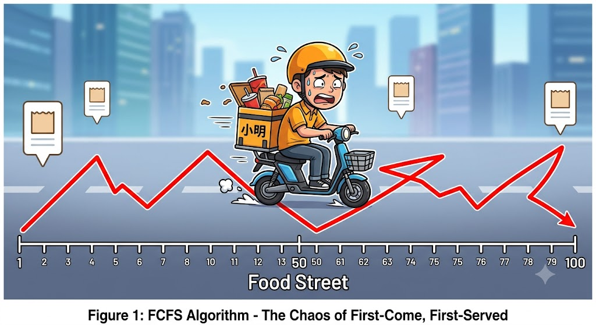
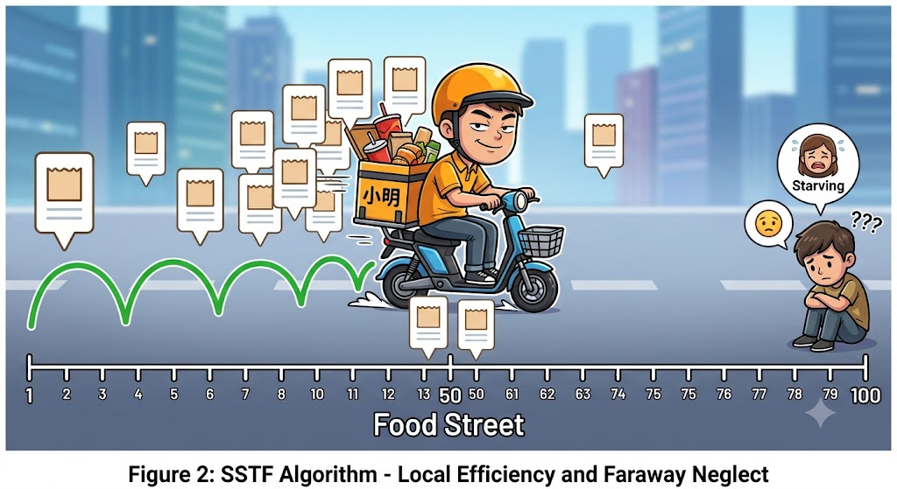
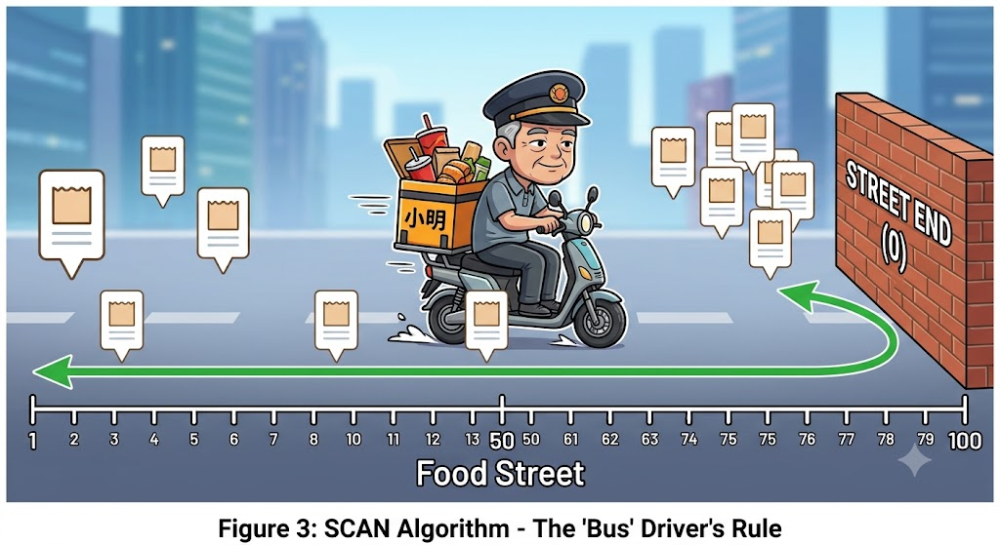
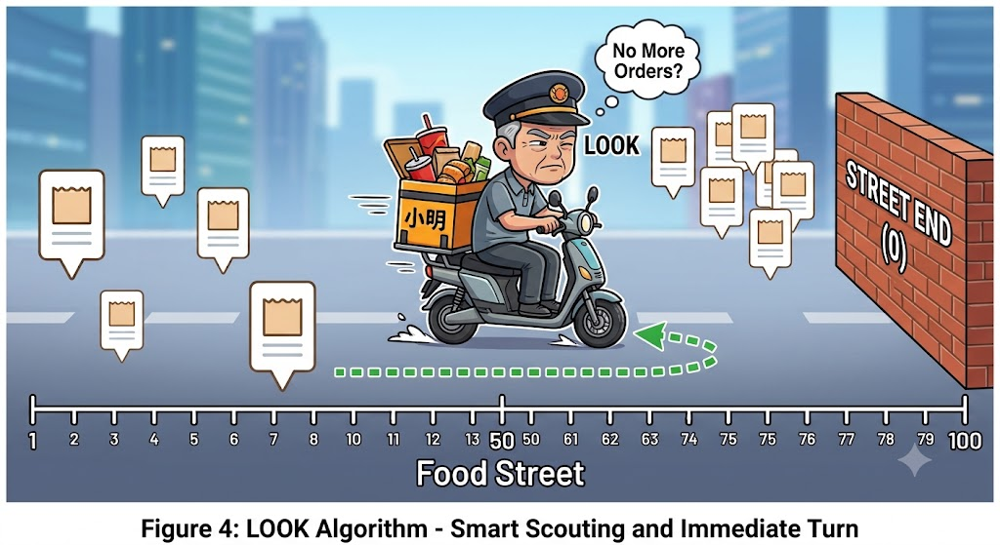
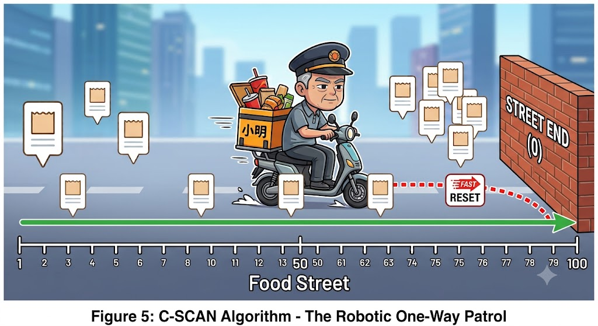

# 电梯算法：从外卖骑手到看电梯算法的终极进化

你有没有想过，当你在电脑上点开一部高清电影、解压一个大文件，或者在游戏里加载宏大场景时，你的计算机深处正在发生着什么？

对于传统的机械硬盘来说，里面有一块高速旋转的盘片，还有一个像留声机指针一样的**磁头**。为了读取数据，这个磁头必须在不同的磁道之间来回移动。这个过程叫做**寻道**。

这听起来很枯燥对吧？没关系，我们把这个场景放大一万倍——**如果把硬盘磁道看作一条“美食一条街”，把磁头看作一位“外卖骑手”，而你读取数据的请求就是“外卖订单”**。

今天，我们就用这位外卖骑手的职业生涯，带你一口气读懂计算机底层最经典的“电梯算法”家族。看看程序员们是如何为了省下几毫秒的寻道时间，硬生生把一个外卖员逼成“时间管理大师”的。

---

## 阶段一：初出茅庐的“直肠子”骑手

### 🛠️ 官方学名：FCFS 算法（First-Come, First-Served，先来先服务）

刚入行的小明是个绝对的“老实人”。他的接单原则极其简单粗暴：**谁先下单，我就先去谁家拿，绝不插队！**

* **派送现场**：
1. 街头（1号店铺）进了一个麻辣烫的单，小明哼哧哼哧跑去街头；
2. 刚拿到手，系统弹出一单，街尾（100号店铺）有人点了奶茶，小明又跨越整条街跑到街尾；
3. 刚停下电动车，街中心（50号店铺）又来了一单炸鸡……

* **骑手现状**：小明这一天下来，微信步数轻松突破五万步，累得直吐舌头，结果所有的外卖还全迟到了，差评满天飞。

> **计算机视角的潜台词**：
> 在计算机早期，**FCFS** 就是这么老实。如果用户交替读取盘沿和盘心的数据，磁头就会像小明一样疯狂折返。这种算法虽然绝对公平，但在高并发的现代计算机里，会让硬件效率低到让人想砸电脑。

---

## 阶段二：精明却自私的“近路狂魔”

### 🛠️ 官方学名：SSTF 算法（Shortest Seek Time First，最短寻道时间优先）

直肠子的小明很快被站长开除了。新来的骑手小刚是个绝顶聪明的“精致利己主义者”。他的座右铭是：**谁离我最近，我就先去谁家！**

* **派送现场**：
小刚此时正站在街中心（50号）。左边 49 号有一单，右边 80 号有一单。小刚心里盘算了一下：“49号近啊！”果断调头去 49 号。
刚到 49 号，48 号又来了一单，他又去了 48 号；接着是 47 号、46 号……
* **骑手现状**：小刚派单确实快，电动车电量省了一半。然而，街尾 80 号的顾客从中午等到天黑，眼睁睁看着小刚在街头和街中心来回晃悠，就是不肯往自己这边走一步。这位顾客急得直骂娘。

> **计算机视角的潜台词**：
> **SSTF** 算法虽然大大减少了磁头的移动距离，但它有一个致命的漏洞——**“饥饿现象（Starvation）”**。如果核心磁道附近源源不断地有新请求进来，那些边缘磁道的请求可能一辈子都得不到响应。绝对的局部自私，往往会带来全局的瘫痪。

---

## 阶段三：规矩成方圆的“公交车老司机”

### 🛠️ 官方学名：SCAN 算法（扫描算法 / 真正的电梯算法）

为了解决“远处的顾客被活活饿死”的行业痛点，外卖站长终于祭出了杀手锏。他给新骑手老张定了一个铁律：**你只要出发，就必须“一条道走到黑”，直到撞到南墙才能掉头！**

这种规矩，完美复刻了我们每天坐的**电梯**：电梯向上运行时，会依次捎上所有想上去的人，直到顶楼，才会掉头向下。

* **派送现场**：
老张从 50 号出发，设定方向向街头（0号）骑。一路上不管谁下单，只要顺路，他就接上。哪怕此时街尾（100号）的订单已经堆积如山，他也绝不回头。
老张一路扫街，直到电动车前轮结结实实地撞到了街尽头的墙壁（0号），他才慢条斯理地调转车头，开始往街尾（100号）骑，依次收拾剩下的订单。
* **骑手现状**：老张虽然看起来有点“轴”，但奇迹发生了——街上的外卖虽然偶尔有微小的延迟，但再也没有人遇到“永远收不到外卖”的绝望情况了。

> **计算机视角的潜台词**：
> **SCAN 算法**就是标准的电梯算法。它通过牺牲一点点“极致的快捷”，换取了**高效性与公平性的完美平衡**。磁头不再疯狂折返，每个扇区的数据都有被读取的机会。

---

## 阶段四：拒绝无效空跑的“打工人代表”

### 🛠️ 官方学名：LOOK 算法（“看着办”算法）

公交车老司机老张跑了几天，发现了一个很傻的事情：有时候最靠近街头的订单明明在 10 号，但按照站长的规定，他必须硬着头皮骑到 0 号撞一下墙才能掉头。从 10 号到 0 号这截路，完全是无效空跑。

于是，老张决定在摸鱼和效率之间找个平衡，学会了**抬头看路（LOOK）**。

* **派送现场**：
老张依然坚持“一条道走到黑”的方向感。当他向着街头骑，送完 10 号店铺的单后，他眯起眼睛往前看了一眼：“前面到 0 号之间好像没有新订单了。”
老张微微一笑，**不再往前空跑，直接就地优雅掉头**，开始往回送。
* **骑手现状**：老张通过“偷看一眼未来的需求”，省下了大量的体力。

> **计算机视角的潜台词**：
> **LOOK 算法**是对电梯算法的**第一次智商升级**。在实际的操作系统中，磁头不会傻傻地每次都跑到磁盘的最边缘，只要前方没有请求，它就会立即改变方向。不干无效的体力活，是现代硬盘调度的核心智慧。

---

## 阶段五：追求终极绝对公平的“单行道巡警”

### 🛠️ 官方学名：C-SCAN / C-LOOK 算法（Circular SCAN，循环扫描）

文章看到这里，你可能觉得 LOOK 算法已经完美无瑕了。但天才的计算机科学家们发现了一个隐藏的“不公”：

当老张刚从街头（0号）掉头往街尾骑时，街头（1号）突然来了一个新单。这个倒霉的 1 号订单，必须等老张一路走到街尾、再掉头走回来才能被送到。他的等待时间，几乎是其他人的两倍！

为了追求**极致的、可预测的绝对公平**，终极进化的算法诞生了——站长直接把这条美食街改成了“单行道”！

* **派送现场**：
老张**只在从左往右骑的时候送货**。他从 0 号一路送到 100 号，沿途顺路的全部送完。
当他到达街尾（100号）后，他不管后面有没有新单，直接闭上眼睛，拧满油门，**以最快速度空车“闪现”跑回街头（0号）**。落地后，重新开始下一轮从左往右的派送。
* **骑手现状**：老张虽然多跑了回程的空路，但整条街上所有位置的顾客发现，自己无论在哪个时间、哪个地点下单，**平均等待外卖的时间都变得一模一样了**！

> **计算机视角的潜台词**：
> 这就是 **C-SCAN（循环扫描）**。在计算机的高并发世界里，有时候**“速度的绝对平稳和可预测”**，比单纯的“有时候快、有时候慢”更加重要。它让系统的表现变得极度稳定。

---

## 结语：从外卖箱到二进制的智慧

从“直肠子”的混乱，到“近视眼”带来的不公，再到“老司机”用规矩建立的秩序，最后到“单行道”对终极公平的追求……

这五个外卖骑手的进化故事，就是计算机科学里最经典的磁盘调度史。你看，那些藏在冰冷机箱里的、由 0 和 1 组成的复杂算法，其实并不神秘。它们的底层逻辑，不过是人类在面对资源有限的世界时，关于“效率”与“公平”的千百次权衡与精妙思考。

下次当你的电脑如丝般顺滑地加载出网页和游戏时，不妨在心里对那位在“数据大街”上风雨无阻、疯狂漂移的“数字骑手”说一声：

**“辛苦了，记得给自己点个五星好评！”**

